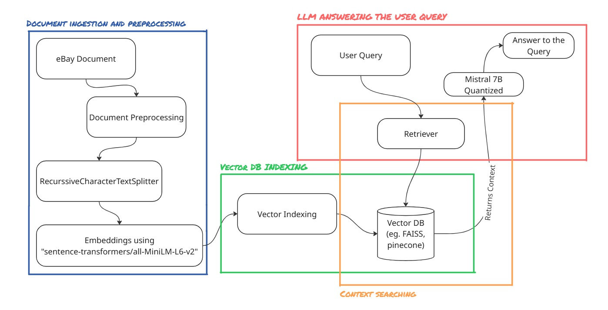

# Retrieval-Augmented Generation (RAG) Chatbot


# Project Architecture and Flow




# Overview
This project implements a Streamlit-based Retrieval-Augmented Generation (RAG) system that allows users to query information grounded in a specific document (e.g., eBay User Agreement). It combines FAISS vector search, SentenceTransformers embeddings, and a quantized Mistral-7B model via Hugging Face for fast and accurate answers.


# Demonstration link
https://drive.google.com/file/d/1VIzFZl7swghIddANUnWfZVPWkqXOM2zK/view?usp=sharing

# Steps to Run

```bash 
git clone https://github.com/aryansuri42/amlgolabs-assignment.git
cd amlgolabs-assignment
pip install -r requirements.txt
streamlit run app.py
```

---

##  Preprocessing and Vector Store Creation

1. **Document Loading & Chunking:**
   - PDF documents are loaded using `PyPDFLoader`.
   - Text is split using `RecursiveCharacterTextSplitter` with:
     - `chunk_size=300`
     - `chunk_overlap=50`
   - This ensures that the document is broken into coherent segments without losing context.

2. **Embedding Generation:**
   - Each chunk is embedded using the `sentence-transformers/all-MiniLM-L6-v2` model.
   - These embeddings capture the semantic meaning of each chunk for better retrieval.

3. **Storing in FAISS Vector Database:**
   - The embeddings are indexed and stored using FAISS, enabling fast similarity search.
   - The index can be saved and reloaded efficiently for production use.

---

## RAG Pipeline using Mistral 7B

- A RAG pipeline is implemented where:
  - The user's query is embedded and compared with the FAISS index.
  - The top-matching chunks (contexts) are retrieved.
  - These contexts are passed to a **Mistral 7B** LLM (quantized) loaded via Hugging Face Transformers.
  - The response is generated using the model’s generate() method with TextIteratorStreamer
  for real-time streaming output.

---

## Streamlit App

- A simple and interactive UI is built using **Streamlit**.
- Key features:
  - Query input box for user.
  - Answer generated using the RAG pipeline.
  - Expandable section to display the exact document context used for the answer.
  - Model name and information shown in the sidebar.
  - Clear chat button to clear the chat

---